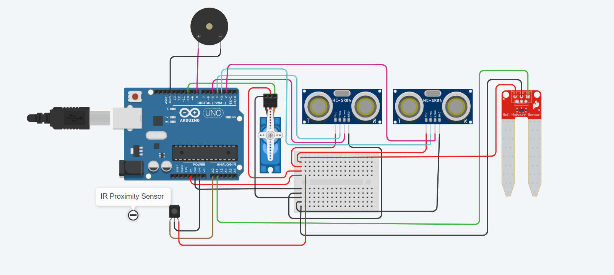

# Waste Segregation System

## Description

This project implements a waste segregation system using Arduino and various sensors. It detects the presence of objects using a proximity sensor, measures soil moisture levels with a soil moisture sensor, and determines the distance to objects using ultrasonic sensors. Based on these inputs, it controls a servo motor to separate waste into bio and non-bio categories.

## Workflow

### Sensors and Pins
- **Proximity Sensor**: Connected to Analog Pin A0
- **Soil Moisture Sensor**: Connected to Analog Pin A1
- **Ultrasonic Sensor 1**: Connected to Trig Pin 4, Echo Pin 5
- **Ultrasonic Sensor 2**: Connected to Trig Pin 3, Echo Pin 2

### Output Devices
- **Servo Motor**: Controlled via PWM Pin 10
- **Buzzer**: Used for indicating object detection, connected to Digital Pin 8

### Operation
1. The system continuously monitors the proximity sensor.
2. If an object is detected, it initiates soil moisture sensing.
3. Based on soil moisture levels:
   - If the soil is wet, the servo motor turns to a specific angle to segregate waste as non-bio.
   - If the soil is dry, the servo motor turns to a different angle to segregate waste as bio.
4. Additionally, ultrasonic sensors measure the distance to detect the presence of objects in specific bins.

## Circuit Diagram

## Usage
Simply place the waste on the top of the trash can, the sensor detect whether the waste are degradable or not, and drop it in its specified storage container

